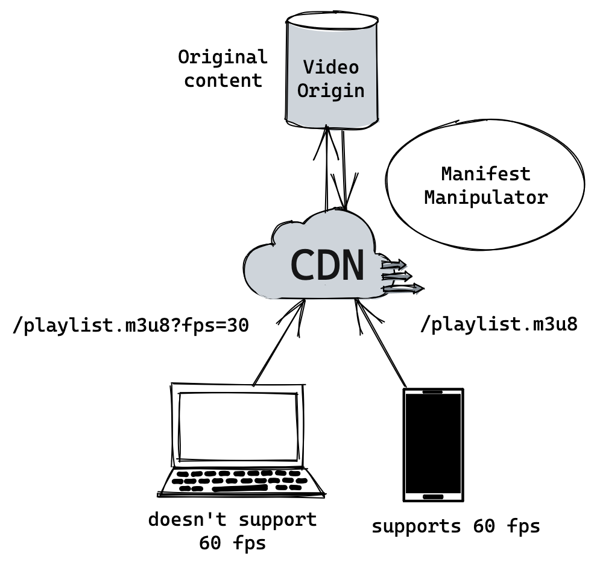

# Manifest Manipulator

Manifest Manipulator is a powerful tool designed to simplify the modification of video manifests. With this tool, you can easily filter video manifests based on bandwidth and frame rate, as well as set the desired manifest as the first one.

## Why?

Video content comes with its fair share of complexities. Certain video manifests may encounter compatibility issues with various devices due to factors such as frame rate, bitrate, or other tags that directly impact smooth playback.

The scenario depicted in the image above perfectly illustrates a common problem: devices incapable of playing videos at 60fps. To address this challenge, we introduce Manifest Manipulator — a solution designed to rewrite video manifests on the fly, just before delivering them to users.

## Features

* **Bandwidth Filtering**: Filter video manifests based on the desired minimum and maximum bandwidth. This allows you to select the appropriate video quality based on available devices. e.g some TVs don't play a too low bandwidth.

* **Frame Rate Filtering**: Filter video manifests based on the desired frame rate. You can specify the desired frame rate to ensure smooth playback on devices with different capabilities.

* **Set First Manifest**: Set a specific video manifest as the first one in the modified manifest. This feature is useful when you want to prioritize a particular video quality or adapt the manifest for specific player requirements.
